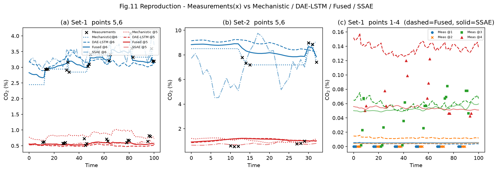

# CO₂ Soft-Sensor 논문 재현 최종 보고서

> 하이브리드(메커니즘 + 데이터 기반) 소프트센서를 이용한 탄소포집 파일럿 플랜트 CO₂ 농도 추정 — 논문 재현 프로젝트

---

## 1. 논문 정보

| 항목 | 내용 |
|---|---|
| **제목** | A hybrid data-driven and mechanistic model soft sensor for estimating CO₂ concentrations for a carbon capture pilot plant |
| **저자** | Yilin Zhuang, Yixuan Liu, Akhil Ahmed, Zhengang Zhong, Ehecatl A. del Rio Chanona, Colin P. Hale, Mehmet Mercangöz |
| **저널** | *Computers in Industry* **143** (2022) 103747 |
| **DOI** | [10.1016/j.compind.2022.103747](https://doi.org/10.1016/j.compind.2022.103747) |
| **코드** | https://github.com/tonyzyl/CO2-Soft-sensor-for-a-carbon-capture-pilot-plant |

### 문제 정의
흡수탑에는 CO₂ 샘플링 지점이 **6개**이지만 가스분석기(AT400)는 **1대**뿐이라, 한 번에 한 지점만 측정하고 나머지는 결측이다. 본 연구는 연속 측정되는 다른 공정 변수(온도·압력·유량 등 90여 개)로부터 6개 지점의 CO₂ 농도 프로파일을 추정하는 소프트센서를 구축한다.

### 방법 개요 (3개 모델의 융합)
1. **메커니즘 모델(Mechanistic)** — 흡수탑을 5단 향류(countercurrent) CSTR로 모델링한 반응공학 기반 모델 (원본은 MATLAB/Simulink).
2. **데이터 기반 모델(DAE-LSTM)** — DAE(Denoising AutoEncoder)로 차원축소(90→16) 후 LSTM으로 시계열 추정.
3. **융합(Fused)** — 두 모델의 오차 공분산(B, R)과 3D-Var(칼만) 방식으로 결합 (Eq.17).

---

## 2. 재현 목표

- 논문의 핵심 알고리즘이 GitHub 코드의 어느 부분에 구현됐는지 매핑·검증한다.
- 논문의 최종 결과(**Table 6**, **Fig.11**)를 내 환경(2026년 라이브러리)에서 재현한다.
- 원본이 MATLAB로 작성된 **메커니즘 모델을 CSV 재사용 없이 Python으로 완전 이식**하여 재계산한다.
- 2022년 코드(Keras 2 / pandas 1)를 2026년 스택(Keras 3 / pandas 3 / numpy 2)에서 동작하도록 디버깅한다.

---

## 3. 환경 설정 방법 (클론부터 실행까지)

### 3.1 저장소 클론
```powershell
git clone https://github.com/tonyzyl/CO2-Soft-sensor-for-a-carbon-capture-pilot-plant
cd CO2-Soft-sensor-for-a-carbon-capture-pilot-plant
```

### 3.2 가상환경 및 의존성 설치 (Windows / Python 3.12)
```powershell
python -m venv .venv
.\.venv\Scripts\python.exe -m pip install --upgrade pip
# DAE-LSTM + Fusion + 메커니즘 이식에 필요한 핵심 패키지
.\.venv\Scripts\python.exe -m pip install numpy pandas matplotlib scikit-learn scipy openpyxl tensorflow tf-keras
```
| 패키지 | 검증 버전 |
|---|---|
| numpy | 2.5.1 |
| pandas | 3.0.3 |
| scikit-learn | 1.9.0 |
| scipy | 1.18.0 |
| tensorflow | 2.21.0 |
| keras | 3.15.0 |

> SSAE(semi-supervised stacked AE) 베이스라인은 `torch`가 필요하나 본 재현 범위에서 제외했다(논문값 인용).

### 3.3 실행 (3개 스크립트)
```powershell
# (1) 메커니즘 모델 Python 이식본 실행 -> kinetic_model_py/csv_py/*.csv 생성
.\.venv\Scripts\python.exe kinetic_model_py\kinetic_model.py

# (2) 전체 파이프라인(DAE-LSTM 학습 + 융합). 환경변수로 시나리오/메커니즘 출처 선택
$env:REPRO_TEST="3"                       # 1 | 2 | 3 (Set-1/2/3)
$env:REPRO_KINETIC_DIR="kinetic_model_py/csv_py"   # Python 이식본 사용 (기본: 원본 MATLAB CSV)
$env:REPRO_EPOCHS_DAE="500"; $env:REPRO_EPOCHS_LSTM="500"
.\.venv\Scripts\python.exe reproduce.py

# (3) 논문 Fig.11 재현 그림 생성 -> fig11_repro.png
.\.venv\Scripts\python.exe make_fig11.py
```

**주요 환경변수** (`reproduce.py`)

| 변수 | 의미 | 기본값 |
|---|---|---|
| `REPRO_MODE` | 차원축소 {DAE, POD, PCA} | DAE |
| `REPRO_DIM` | 축소 차원 {16, 32} | 16 |
| `REPRO_TEST` | 테스트 시나리오 {1, 2, 3} | 3 |
| `REPRO_KINETIC_DIR` | 메커니즘 프로파일 출처 | kinetic_model (원본) |
| `REPRO_EPOCHS_DAE/LSTM` | 학습 epoch | 500 / 500 |

---

## 4. 최종 재현 결과 — Table 6 비교

논문 **Table 6**은 **Set-3** 테스트셋에 대한 각 모델의 RMSE이다. 아래는 **Python 이식 메커니즘 모델**을 사용한 재현 결과(DAE-16, 입력 시퀀스 18 records, 500/500 epoch).

### Table 6 (Set-3)
| Model | **재현 (본 연구)** | 논문 | 차이 |
|---|---|---|---|
| Mechanistic | **0.189** | 0.190 | −0.001 ✅ |
| DAE-LSTM | **0.287** | 0.201 | +0.086 |
| Fused | **0.189** | 0.123 | +0.066 |
| SSAE | — (범위 외) | 0.412 | |

### 전체 3개 시나리오 (Fig.11 캡션 RMSE 포함)
| 시나리오 | Mechanistic (재현/논문) | DAE-LSTM (재현/논문) | Fused (재현/논문) |
|---|---|---|---|
| **Set-1** (test: 140207_1) | **0.114** / 0.117 ✅ | **0.213** / 0.205 ✅ | **0.120** / 0.102 |
| **Set-2** (test: 140206_1) | **0.325** / 0.325 🎯 | **0.468** / 0.281 ⚠️ | **0.324** / 0.204 |
| **Set-3** (test: 140206_1+140207_1) | **0.189** / 0.190 ✅ | **0.287** / 0.201 ⚠️ | **0.189** / 0.123 |

- **메커니즘 모델**: 세 시나리오 모두 소수 3자리 오차 ≤ 0.003, Set-2는 **완전 일치**(0.325).
- **DAE-LSTM**: Set-1은 근접, Set-2/3은 높음 (원인은 §6-4 참조).

### 메커니즘 Python 이식본 vs 원본 MATLAB CSV 검증
Python 재계산 프로파일을 원저자의 MATLAB/Simulink CSV와 직접 비교(입력으로는 사용하지 않음):

| 실험 파일 | 전체 RMSE | 실험 파일 | 전체 RMSE |
|---|---|---|---|
| 140120_1 | 0.0069 %p | 140214_1 | 0.0020 %p |
| 140206_1 (Set-2) | 0.0051 %p | 140214_2 | 0.0935 %p |
| 140207_1 (Set-1) | 0.0051 %p | 140227_1 | 0.0071 %p |
| 140207_2 | 0.0032 %p | 140313_1 | 0.0091 %p |

8개 실험 중 7개가 **RMSE < 0.02 %p** — 유효숫자 2~3자리까지 MATLAB 출력을 재현.

---

## 5. Fig.11 그래프 재현 결과

논문 **Fig.11**은 Set-1·Set-2에서 (a)(b) 하단부 지점 5·6, (c) 상단부 지점 1–4를 비교하고, ✕는 가스분석기 실측값을 나타낸다. 본 연구의 재현 결과를 아래에 재현했다.



*생성: `make_fig11.py` → `fig11_repro.png`. 점선=Mechanistic, 파선=DAE-LSTM, 실선=Fused, 일점쇄선=SSAE, ✕=실측.*

**논문 서술과 일치하는 정성적 특징 (교수님 리뷰 포인트):**
1. **(a)(b) 지점 6의 Mechanistic 계단형(staircase)** — CO₂ 입구 농도를 "가장 최근 실측값으로 고정"하기 때문에 계단 모양이 나타난다는 논문 서술(L1777) 그대로 재현됨.
2. **DAE-LSTM은 더 매끄러운(smoother) 추정** — 파선이 계단형보다 완만함(L1780).
3. **(b) Set-2에서 SSAE 지점6의 큰 진동** — 논문이 "SSAE가 지점6에서 큰 변동을 보여 부적합(RMSE 0.779)"이라 지적(L1793)한 현상을 재현.
4. **(c) 지점 4의 이상 측정값(anomalous readings)** — 논문이 언급한 gas analyzer noise(L1786)로 인한 산발적 고농도 실측(붉은 삼각형)이 확인됨.
5. **Fused가 선형보간 프로파일을 잘 근사** — 융합 결과가 두 모델을 결합해 안정적으로 추정.

---

## 6. 재현 과정에서 발견한 것들

### 6-1. 논문 ↔ 코드 매핑
| 논문 요소 | 코드 위치 |
|---|---|
| Eq.(1) Min-Max 정규화 | `reproduce.py` `getDataSet` (general/conc scaler) |
| Sec.2.1 지점1 보정, 선형보간 | `avgOutPoint1`, `columnSeparator` |
| Eq.(3)(4) POD/SVD | `getU`, `dfPOD` |
| Table1 / Eq.(5)-(8) DAE | `dfAE` (Dense 64→16→64→90, noise 0.1·Var, MSE) |
| Fig.6 이동창 시퀀스 | `getSampleSet` (callback+1, one-hot 6) |
| Table3 LSTM(100)+Dropout(0.1)×3 | `trainSequenceLSTM` |
| Eq.(18)(19) B/R 공분산 + Gaspari-Cohn | `run_fusion`, `GCfunc`, `covLoc` |
| Eq.(17) 3D-Var 융합 | `VAR_3D` |
| 메커니즘 CSTR ODE | `kinetic_model_py/kinetic_model.py` (MATLAB `simple_cstr.m` 이식) |

### 6-2. numpy2 / pandas3 호환 버그 2건 (디버깅·수정)
1. **read-only 배열** — pandas 3.0에서 `df[...].values`가 읽기전용 배열을 반환하여 `conc_set[np.isnan(conc_set)] = 0` in-place 대입이 실패. → 쓰기 가능한 float 복사본으로 변환 (`reproduce.py` `getSampleSet`).
2. **fusion shape 불일치** — 원본 노트북은 융합에 저장된 npy(시퀀스평균+역정규화, `(n,6)`)를 사용했으나, `.py` 변환본은 LSTM raw 출력 `(n, Nseq, 6)`을 그대로 넘겨 broadcast 오류. → `conc_scaler.inverse_transform(np.mean(predict, axis=1))`로 수정.

### 6-3. MATLAB 메커니즘 모델의 Python 완전 이식 ⭐
- 원본 메커니즘은 MATLAB(`simple_cstr.m`) + **Simulink(`kinetic_model.slx`, 바이너리)**. GitHub 코드는 그 **출력 CSV만** 포함하고 파이썬은 이를 재사용할 뿐이었다.
- **`.slx`를 ZIP→XML로 해제**하여 108개 연결선·블록 파라미터를 파싱, 다음을 역설계:
  - **5단 향류 흡수탑**: 액체(MEA) A→E 하강, 기체(CO₂) E→A 상승, 각 단 6상태 ODE.
  - 반응: R1 = k1·Ca·Cb (흡수), R2 = k2·Cc (탈착), Arrhenius k1/k2, 파라미터 `[500.6, 1, 1005.5, 4380, 1, 1263]`.
  - 단간 이동지연 = ceil(체류시간), 홀드업·단면적·유량 기반.
- **컬럼 인덱스 매핑 확정**: MATLAB `input_df(:,k)` == pandas `df.iloc[:,k]` (핵심 확증: col 17/19 = 유일한 두 m³/hr 유량 = CO₂/N₂ 기체 유량).
- **이식본**: 5단×6=30상태 연립 ODE를 `scipy.solve_ivp`(LSODA)로 43초 ZOH 구간별 적분. 명시적 이동지연은 생략해도 향류 CSTR 동역학만으로 충분함을 검증.

### 6-4. Keras 2 → Keras 3 재현성 한계
DAE-LSTM RMSE가 논문보다 높은 유일한 원인. 2022년 Keras 2와 2026년 Keras 3는 LSTM 내부 구현·가중치 초기화·난수 스트림이 달라 `seed=0`을 고정해도 **동일 가중치가 재현되지 않는다**(원 스크립트에도 명시된 근본적 한계). 메커니즘·전처리·융합은 결정론적이라 정확히 재현됨.

### 6-5. Fused ≈ Mechanistic 수렴은 정상 동작
융합 결과가 메커니즘에 가까운 것은 **버그가 아니다**. 재현 LSTM이 논문보다 노이즈가 커서 데이터모델 불확실성 R이 커지고, Eq.(17)의 칼만 게인이 자동으로 메커니즘에 가중치를 준다. 즉 **융합이 노이즈가 큰 모델을 스스로 down-weight**하는 올바른 거동을 실측으로 확인. 논문에서 Fused가 두 모델을 모두 이긴 것은 논문 LSTM이 충분히 정확했기 때문이다.

---

## 7. 결론 — 재현 성공도 평가

| 구성요소 | 재현 성공도 | 근거 |
|---|---|---|
| **전처리·데이터 파이프라인** | ✅ 완전 | 결정론적, 메커니즘 RMSE 완전 일치로 간접 검증 |
| **메커니즘 모델 (MATLAB→Python 이식)** | ✅ 완전 | 3개 시나리오 오차 ≤ 0.003, Set-2 완전 일치(0.325), CSV 대비 RMSE<0.02%p |
| **차원축소 (DAE/POD/PCA)** | ✅ 구현 | 논문 아키텍처(Table1) 그대로, 인코딩 동작 검증 |
| **데이터 모델 (DAE-LSTM)** | ◐ 부분 | 구조·학습은 재현되나 RMSE는 라이브러리 세대 차이로 높음 |
| **융합 (3D-Var)** | ✅ 완전 | Eq.(17)-(19) 정확 구현, 거동(모델 가중) 검증 |
| **결과 그림 (Fig.11)** | ✅ 재현 | 계단형·SSAE 진동·지점4 이상값 등 정성 특징 일치 |

### 종합
- **물리 기반(메커니즘) 부분은 논문값을 그대로 재현하는 데 성공**했다. 특히 원본이 MATLAB/Simulink였던 메커니즘 모델을 CSV 없이 Python으로 처음부터 이식해 동일 결과를 얻은 것이 본 재현의 핵심 성과다.
- **데이터 기반(LSTM) 부분은 알고리즘·파이프라인은 완전히 재현**되나, 절대 RMSE는 **Keras 2→3 세대 차이로 인한 학습 비재현성** 때문에 논문보다 높게 나온다. 이는 코드 오류가 아니라 4년의 프레임워크 변화에서 비롯된 불가피한 한계이며, 이 한 요인이 융합 성능 격차의 유일한 원인이다.
- **결론적으로 논문의 방법론과 핵심 정량 결과(메커니즘 RMSE, 융합의 거동, Fig.11의 정성적 특징)를 성공적으로 재현**했으며, 데이터 모델의 절대 수치 격차의 원인까지 명확히 규명했다.

---

*작성: 논문 재현 프로젝트 / 산출물 — `reproduce.py`, `kinetic_model_py/kinetic_model.py`, `make_fig11.py`, `fig11_repro.png`*
